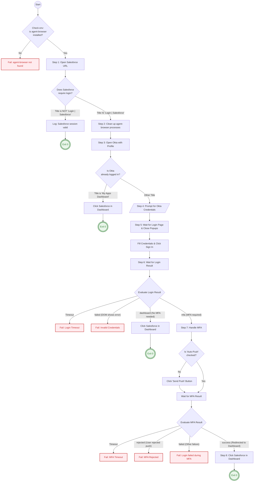

# SUSE Support Case Skills (Salesforce)

A collection of skills for operating SUSE Support Cases in Salesforce.

## Prerequisites

- OpenClaw
- Agent Browser: For security reasons, there is no skill for login. Please log in manually before using the following skills.

## Login to Salesforce via Okta

This `suse_okta_salesforce_login.sh` script automates the login process to Salesforce via Okta using agent-browser.

It intelligently determines whether login is required and handles multiple scenarios including:

- Existing active Salesforce session
- Cached Okta session (no login required)
- Standard login with username/password
- MFA (Okta Verify push)
- MFA rejection or login failure

### Flowchart



### Usage

```bash
bash ./suse_okta_salesforce_login.sh
```

### Debug

```bash
bash -x ./suse_okta_salesforce_login.sh
```

## Features

- `suse_support_case_accept`: Accept a case
- `suse_support_case_download_files`: Download case attachments
- `suse_support_case_reply`: Reply to a case
- `suse_support_case_search_queue`: View case queues
- `suse_support_case_view`: View case details
